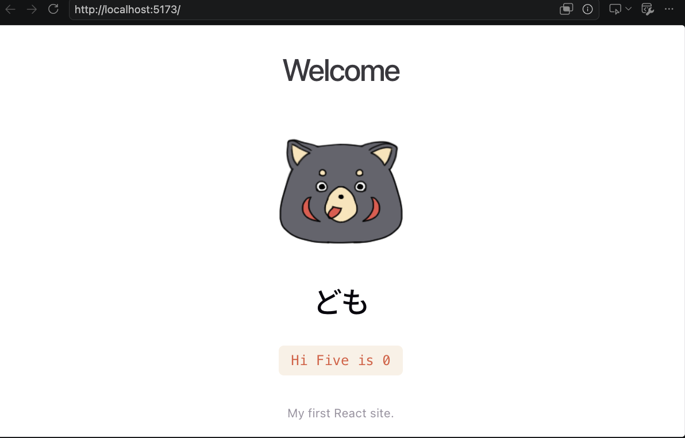

A simple React practice project built with Vite and React.



## How to Run the Project
In the project directory, open a terminal and run:
```zsh
npm install
npm run dev
```

open http://localhost:5173/

### Disclaimer:
ChatGPT was used to assist in improving and optimizing the site styling and layout.

### Copyright:
Bear emoji designed by pawpawchan © 2026
[Shop](https://store.line.me/emojishop/product/6a278136d868932001df0522/en)